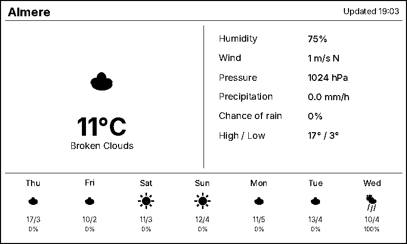
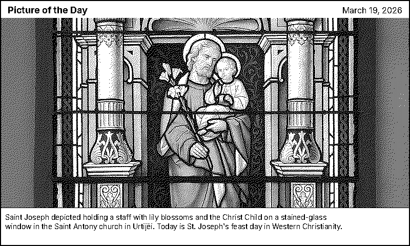
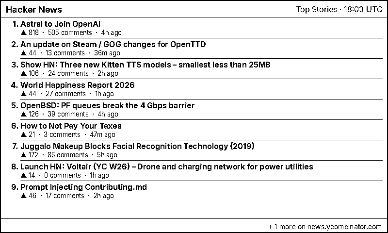
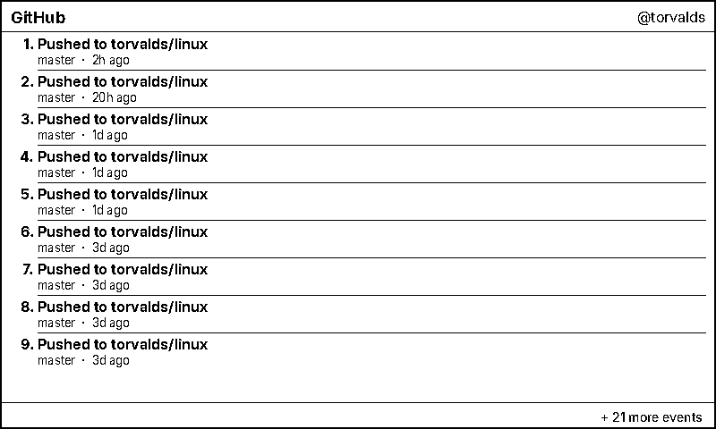
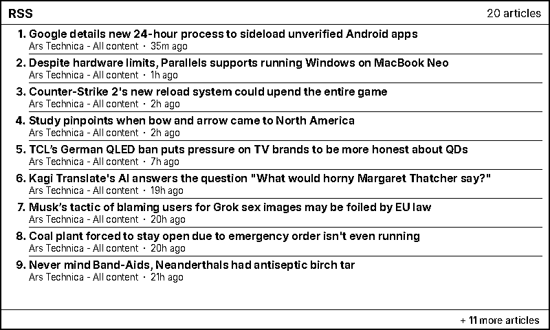
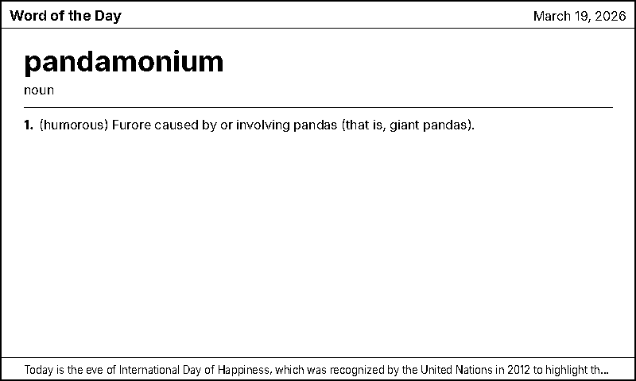
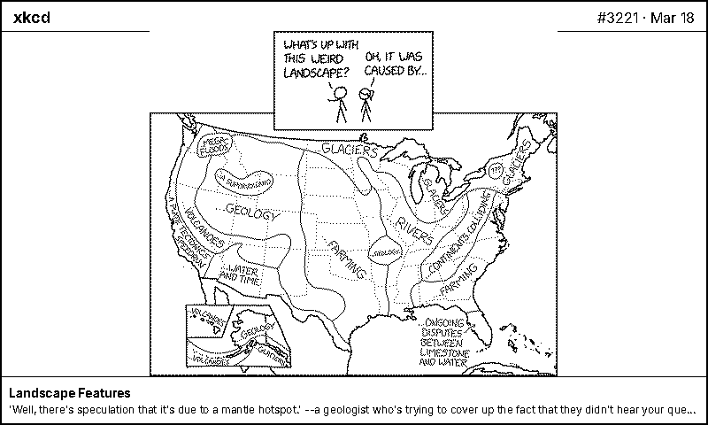
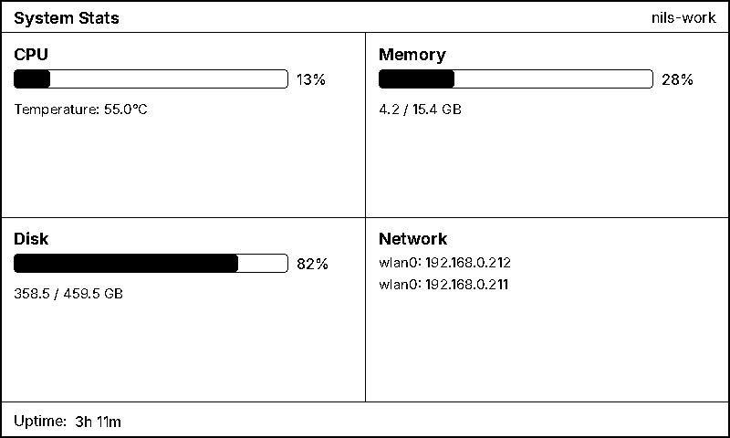

# display-thingy

E-paper display manager for Raspberry Pi with pluggable views. Rotates
through one or more views on each refresh cycle, rendering to a
Waveshare 7.5" V2 (800x480) 1-bit display.

## Hardware

- Raspberry Pi 3B+ (or newer)
- Waveshare 7.5inch E-Paper V2 (800x480)
- The display connects via the SPI GPIO header (HAT connector or jumper wires)

## Quick Install (Raspberry Pi OS)

This installs dependencies, enables SPI, installs a systemd service, and
optionally reboots. By default it configures `DISPLAY_VIEWS="system"`
so the display works without any API keys.

```bash
curl -sSL https://raw.githubusercontent.com/nils-degroot/display-thingy/main/deploy/bootstrap.sh | bash
```

After reboot, the service starts automatically. To change views, edit
`~/display-thingy/.envrc` and re-run the deploy script to apply:

```bash
~/display-thingy/deploy/update.sh
```

## Raspberry Pi Setup

### 1. Enable SPI

```bash
sudo raspi-config
# Interface Options → SPI → Enable
sudo reboot
```

### 2. Install system dependencies

```bash
sudo apt update
sudo apt install -y python3-dev python3-lgpio git libopenjp2-7 libtiff6
```

### 3. Add your user to the gpio and spi groups

This allows running without `sudo`:

```bash
sudo usermod -aG gpio,spi $USER
sudo reboot
```

### 4. Install uv

```bash
curl -LsSf https://astral.sh/uv/install.sh | sh
source ~/.bashrc
```

### 5. Clone and install the project

```bash
git clone https://github.com/nils-degroot/display-thingy.git ~/display-thingy
cd ~/display-thingy
uv sync --extra pi
```

### 6. Install the Waveshare e-Paper driver

```bash
cd /tmp
git clone https://github.com/waveshareteam/e-Paper.git
cd e-Paper/RaspberryPi_JetsonNano/python
uv pip install --python ~/display-thingy/.venv/bin/python .
cd ~/display-thingy
```

### 7. Configure

```bash
cp .envrc.example .envrc
```

Edit `.envrc` and fill in your values. No configuration is required for
the `system` view. If you enable the `weather` view, you need an
OpenWeatherMap API key:

```bash
export OPENWEATHERMAP_KEY="your_api_key_here"  # https://openweathermap.org/api
export LATITUDE="52.3508"
export LONGITUDE="5.2647"
export LOCATION_NAME="Almere"
```

See [Views](#views) below for per-view configuration and how to enable
view rotation.

### 8. Test it

```bash
source .envrc
uv run display-thingy
```

The display should update with system stats (by default). Press `Ctrl+C` to stop.

### 9. Install as a system service

```bash
./deploy/install.sh
```

This script will:
- Generate a systemd-compatible env file at `~/.display-thingy.env` from your `.envrc`
- Install a systemd service unit with the correct user and paths
- Enable and start the service

Check status and logs:

```bash
sudo systemctl status display-thingy
journalctl -u display-thingy -f
```

## Views

The display rotates through one or more views, advancing to the next
view on each refresh cycle. Configure which views to show and in what
order with the `DISPLAY_VIEWS` env var (comma-separated):

```bash
export DISPLAY_VIEWS="system"                   # single view (default)
export DISPLAY_VIEWS="weather,wikipedia,tasks,hackernews,github,rss,wikiquote,wiktionary,calendar,xkcd,system"  # rotate through all
```

Other global display settings:

| Variable           | Default     | Description                          |
|--------------------|-------------|--------------------------------------|
| `REFRESH_INTERVAL` | `900`       | Seconds between refreshes (900 = 15 min) |
| `PREVIEW_MODE`     | `false`     | Save PNG to `preview/` instead of driving e-paper |

### `weather` -- Current weather and 7-day forecast

Shows current conditions (temperature, humidity, wind, pressure,
precipitation) alongside a 7-day forecast strip. Data comes from the
[OpenWeatherMap One Call API](https://openweathermap.org/api/one-call-3).



| Variable             | Default   | Description                          |
|----------------------|-----------|--------------------------------------|
| `OPENWEATHERMAP_KEY` | *required* | Your OpenWeatherMap API key         |
| `LATITUDE`           | `52.3508` | Location latitude                    |
| `LONGITUDE`          | `5.2647`  | Location longitude                   |
| `LOCATION_NAME`      | `Almere`  | Display name shown in the header     |
| `UNITS`              | `metric`  | `metric`, `imperial`, or `standard`  |
| `LANG`               | `en`      | Language code for weather descriptions |

### `wikipedia` -- Wikipedia Picture of the Day

Fetches the Wikimedia Commons featured image for today, dithers it to
1-bit with Floyd-Steinberg, and renders it with a title bar and caption.
No additional configuration is needed -- this view has no required env
vars.



### `tasks` -- Pending tasks from CalDAV

Connects to any CalDAV server (Nextcloud, Radicale, Baikal, etc.) and
shows incomplete VTODO items sorted by priority then due date. Subtasks
are shown with single-level indentation beneath their parent.

| Variable           | Default     | Description                          |
|--------------------|-------------|--------------------------------------|
| `CALDAV_URL`       | *required*  | Server URL, e.g. `https://cloud.example.com` |
| `CALDAV_USERNAME`  | *required*  | CalDAV username                      |
| `CALDAV_PASSWORD`  | *required*  | App password (recommended over main password) |
| `CALDAV_TASK_LISTS`| *(empty)*   | Comma-separated list names to show; empty = all lists |

These env vars are only required when `tasks` is included in
`DISPLAY_VIEWS`. If the CalDAV server is unreachable, the view renders
an error message instead of crashing.

### `calendar` -- Upcoming events from CalDAV

Shows a 7-day agenda grouped by day, with times, event titles, and
optional locations. Connects to the same CalDAV server as the `tasks`
view. Recurring events (RRULE/RDATE) are expanded so weekly meetings,
birthdays, etc. appear correctly. All-day events are shown in bold
before timed events.

| Variable           | Default     | Description                          |
|--------------------|-------------|--------------------------------------|
| `CALDAV_URL`       | *required*  | Server URL (shared with `tasks`)     |
| `CALDAV_USERNAME`  | *required*  | CalDAV username (shared with `tasks`) |
| `CALDAV_PASSWORD`  | *required*  | App password (shared with `tasks`)   |
| `CALDAV_CALENDARS` | *(empty)*   | Comma-separated calendar names to show; empty = all |

These env vars are only required when `calendar` is included in
`DISPLAY_VIEWS`. If the CalDAV server is unreachable, the view renders
an error message instead of crashing.

### `hackernews` -- Hacker News top stories

Shows the top 10 stories from the Hacker News front page, each with
its score, comment count, and a relative timestamp. Uses the public
[HN Firebase API](https://github.com/HackerNews/API). No additional
configuration is needed -- this view has no required env vars.



### `github` -- GitHub activity feed

Shows your recent GitHub activity (pushes, pull requests, issues,
stars, releases, forks, code reviews, and comments) as a ranked feed
sorted by time. Uses the
[GitHub Events API](https://docs.github.com/en/rest/activity/events).



| Variable          | Default   | Description                                     |
|-------------------|----------|-------------------------------------------------|
| `GITHUB_USERNAME` | *(empty)* | GitHub username to show events for              |
| `GITHUB_TOKEN`    | *(empty)* | Personal access token (optional but recommended) |

A token is not required for public activity, but providing one enables
private-repo events and raises the API rate limit from 60 to 5000
requests per hour. If you use a **classic** personal access token, it
needs the `repo` scope. If you use a **fine-grained** token, grant
read-only access to **Contents** on the repositories whose events you
want to see. These env vars are only required when `github` is included
in `DISPLAY_VIEWS`.

### `rss` -- RSS/Atom feed reader

Fetches one or more RSS or Atom feeds, merges all entries into a single
timeline sorted by publication date (newest first), and shows the top 10
articles with feed names and relative timestamps. Uses
[feedparser](https://feedparser.readthedocs.io/) for broad format
compatibility.



| Variable    | Default  | Description                                     |
|-------------|----------|-------------------------------------------------|
| `RSS_URLS`  | *(empty)* | Comma-separated list of feed URLs              |
| `RSS_TITLE` | `RSS`    | Custom header title (e.g. `"My Feeds"`, `"Blogs"`) |

These env vars are only required when `rss` is included in
`DISPLAY_VIEWS`. If no URLs are configured, the view renders an error
message.

### `wikiquote` -- Wikiquote Quote of the Day

Displays the Wikiquote Quote of the Day in a poster-style layout with
large decorative curly quotes and right-aligned attribution. Fetches
from the [MediaWiki parse API](https://www.mediawiki.org/wiki/API:Parsing_wikitext).
The font size adapts automatically for longer quotes. No additional
configuration is needed -- this view has no required env vars.


### `wiktionary` -- Wiktionary Word of the Day

Displays the Wiktionary Word of the Day in a dictionary-page layout
with the word, part of speech, and numbered definitions. Parses the
WOTD template from the
[MediaWiki parse API](https://www.mediawiki.org/wiki/API:Parsing_wikitext).
Multi-level definitions (label-only headings with sub-definitions) are
promoted and labelled automatically. The font size adapts for words
with many definitions. No additional configuration is needed -- this
view has no required env vars.



### `xkcd` -- xkcd latest comic

Displays the latest xkcd comic, scaled to fit the display without
cropping. The title and alt text (the hover text from the website) are
shown in a footer bar below the image. Fetches directly from the
[xkcd JSON API](https://xkcd.com/json.html). No additional
configuration is needed -- this view has no required env vars.



### `system` -- System stats dashboard

Displays a dashboard of local system information: CPU usage and
temperature, memory and disk utilisation (with progress bars), network
interfaces with IP addresses, and system uptime. Uses
[psutil](https://github.com/giampaolo/psutil) to collect stats. No
additional configuration is needed -- this view has no required env
vars.



CPU temperature is read from the SoC thermal sensor (available on
Raspberry Pi and most Linux systems). On machines without temperature
sensors, the value is shown as "N/A".

## Development

On your dev machine (no e-paper hardware needed), the display output is saved as PNG files in the `preview/` directory.

```bash
# Install dependencies
uv sync

# Set up config
cp .envrc.example .envrc
# Edit .envrc with your API key and location

# Run (saves preview/latest.png)
source .envrc
uv run display-thingy
```

## Adding a New View

Views are self-contained modules that fetch data and render an 800x480 image.

1. Create a file in `src/display_thingy/views/`, e.g. `calendar.py`
2. Implement a view class:

```python
from PIL import Image, ImageDraw
from display_thingy.views import BaseView, registry

@registry.register
class CalendarView(BaseView):
    name = "calendar"
    description = "Upcoming calendar events"

    def render(self, width: int, height: int) -> Image.Image:
        img = Image.new("1", (width, height), 1)  # white background
        draw = ImageDraw.Draw(img)
        # ... your rendering logic ...
        return img
```

3. Add `calendar` to your `DISPLAY_VIEWS`:

```bash
export DISPLAY_VIEWS="weather,calendar"
```

## Wiring

If using the Waveshare HAT, just plug it onto the Pi's GPIO header. For jumper wires:

| Display Pin | Pi GPIO Pin | Function |
|-------------|-------------|----------|
| VCC         | 3.3V (pin 1) | Power |
| GND         | GND (pin 6)  | Ground |
| DIN         | GPIO 10 / MOSI (pin 19) | SPI data |
| CLK         | GPIO 11 / SCLK (pin 23) | SPI clock |
| CS          | GPIO 8 / CE0 (pin 24) | Chip select |
| DC          | GPIO 25 (pin 22) | Data/command |
| RST         | GPIO 17 (pin 11) | Reset |
| BUSY        | GPIO 24 (pin 18) | Busy signal |
